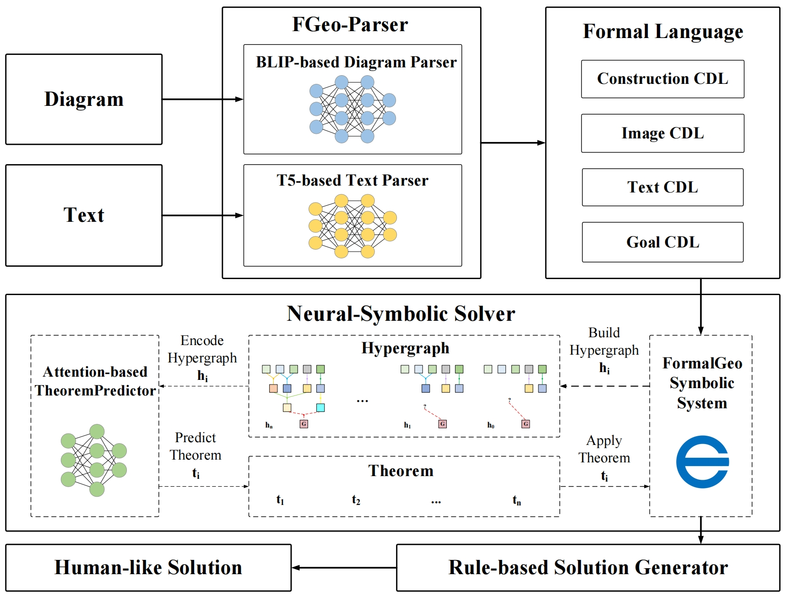
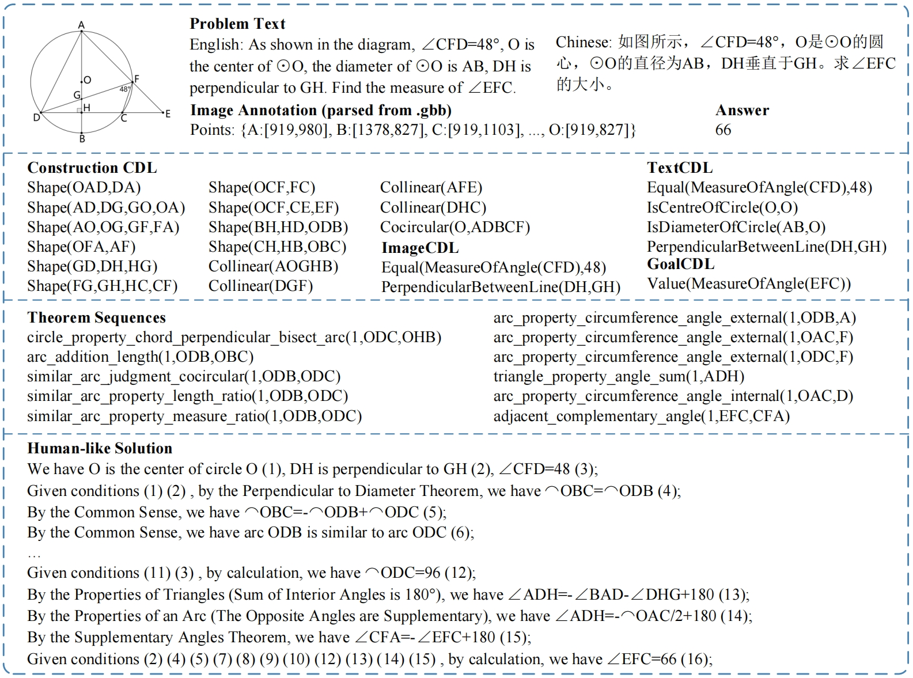

## FGeo-Parser

We propose FGeo-Parser, an automatic parser for geometric problems that converts geometric images and text into the formal language of FormalGeo to facilitate subsequent problem-solving. It is divided into a Diagram Parser and a Text Parser, with the former based on the BLIP model and the latter on the T5 model. The parsed CDL is fed into FGPS and combined with the theorem predictor Hyper-GNet for problem solving. Finally, a rule-based generator produces solutions approximating human reasoning.

	
	

## FormalGeo Dataset

We enhanced the FormalGeo7K dataset to create FormalGeo7K-v2, expanding the 123 problem count to 7,000, standardizing the problem presentation style, and correcting several 124 annotation errors. Additionally, we used GeoGebra to relabel high-quality geometric 125 diagrams that include detailed positional information for geometric elements such as 126 points and lines, making them suitable for various types of diagram parsing tasks.

### Example

	
	

## Environmental Settings
- Python version: **3.10**
- CUDA version: **12.1**
- GCC version: **11.4.0**

### Evaluation
   
We use match accuracy and perfect accuracy as evaluation indicators of parsing, and the results of our work are as follows:

| Method      | Math(%) | Perfect(%) | 
|-------------|-------|------------|
| FGeo-Parser | 91.51 | 56.47      |

In addition, We integrated the FGeo-Parser and theorem predictor Hyper-GNet within FGPS for problem solving, using problem-solving success accuracy as the evaluation metric. The results of our work are as follows:

| Method   | Solve(%) | 
|----------|----------|
| Ours     | 63.45    |
| Ours(gt) | 85.53    |

